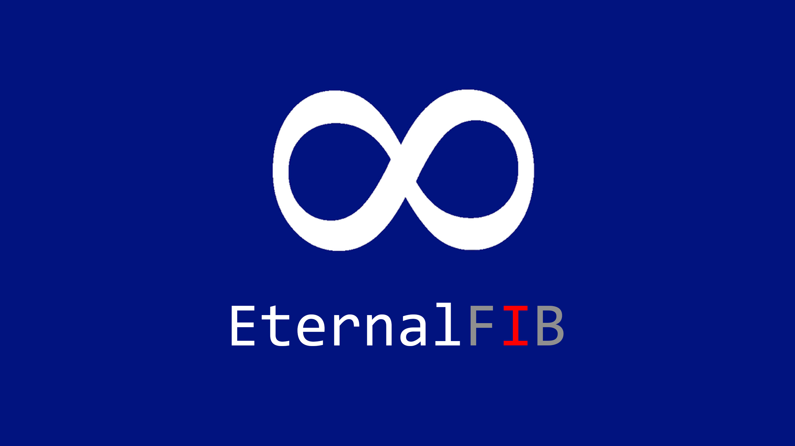

# EternalFIB
Repositori personal amb `guies`, `apunts`, `programes` i `recursos` per cada assignatura de la FIB. 
Feel free d'agafar-ho tot i ensenyar-li a qui ho necessiti.  

  

 

# 📹 YOUTUBE
- [YT | RESUM - Primer Any](https://youtu.be/ofNDwrA_IAE?si=fqjr-DZFdj3dNx6Y)

 

# 📚 ASSIGNATURES
## Quatrimestre 1
- [Física](https://github.com/impulsado/EternalFIB/tree/main/F)
- [Fonaments Matemàtics](https://github.com/impulsado/EternalFIB/tree/main/FM)
- [Introducció als Computadors](https://github.com/impulsado/EternalFIB/tree/main/IC)
- [Programació 1](https://github.com/impulsado/EternalFIB/tree/main/PRO1)

## Quatrimestre 2
- [Estructura de Computadors](https://github.com/impulsado/EternalFIB/tree/main/EC)
- [Matemàtiques 1](https://github.com/impulsado/EternalFIB/tree/main/M1)
- [Matemàtiques 2](https://github.com/impulsado/EternalFIB/tree/main/M2)
- [Programació 2](https://github.com/impulsado/EternalFIB/tree/main/PRO2)

## Quatrimestre 3
- [Bases De Dades](https://github.com/impulsado/EternalFIB/tree/main/BD)
- [Computer Interfaces](https://github.com/impulsado/EternalFIB/tree/main/CI)
- [Estructures de Dades i Algorismia](https://github.com/impulsado/EternalFIB/tree/main/EDA)
- [Probabilitat i Estadística](https://github.com/impulsado/EternalFIB/tree/main/PE)
- [Sistemes Operatius](https://github.com/impulsado/EternalFIB/tree/main/SO)

 

# 🌐 WEBS
## General
- GradeCalc  
https://gradecalc.mauri.app/  

- UPCCommons  
https://upcommons.upc.edu/handle/2117/134992  

## Respostes/Solucions
- RepoFIBtori  
https://github.com/RepoFIBtori/RepoFIBtori/tree/master  

- FIBerHub  
https://gitlab.com/Toomoch/fiberhub.cat  

- FIBernalia  
https://fibernalia.blogspot.com/  

- FIBers   
https://fibers.cat/  

- Wuolah  
https://wuolah.com/upc-facultad-informatica-barcelona-fib/grado-ingenieria-informatica  